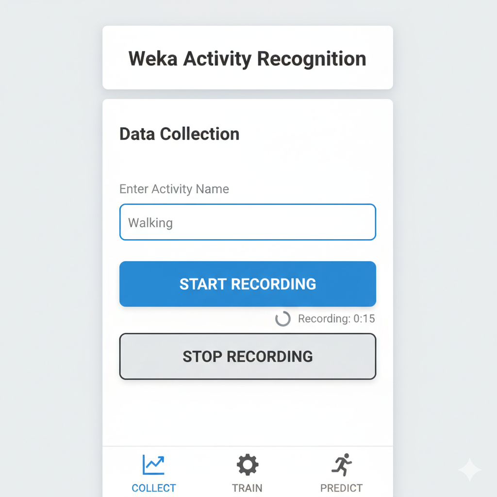
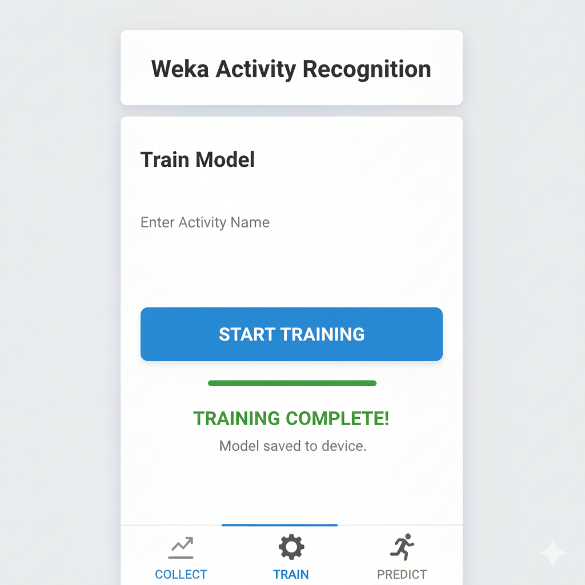
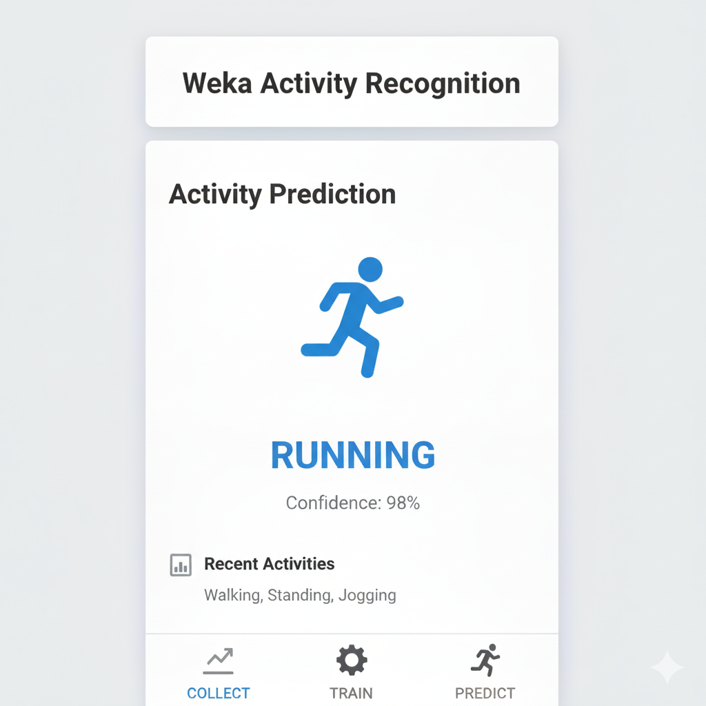

# Weka Activity Recognition (Android)

[](https://developer.android.com/google/play/requirements/target-sdk)
[](https://docs.oracle.com/javase/8/docs/api/)
[](https://www.cs.waikato.ac.nz/ml/weka/)

**Weka Activity Recognition** is a fully functional Android application that uses the device's sensors (Gyroscope/Accelerometer) to perform Human Activity Recognition (HAR) directly on the edge. 

Unlike standard apps that only deploy pre-trained models, this application allows users to **collect data, train a machine learning model, and deploy it entirely on their smartphone**, without needing a backend server.

---

## Features

* **Data Collection:** Record raw sensor data directly from the device while performing specific activities (e.g., Walking, Running, Standing).
* **On-Device Training:** Utilizes the Weka library to train a classification model locally on the phone using the collected data.
* **Real-Time Inference:** Deploys the trained model immediately to recognize and predict user activities in real-time.
* **File Management:** Saves training sets (ARFF files) and models locally for reuse.

## How It Works

The app follows a standard Machine Learning pipeline implemented entirely in Java on Android:

1.  **Data Acquisition:** The app accesses the Android `SensorManager` to stream Gyroscope and Accelerometer data.
2.  **Preprocessing:** Data is formatted into Weka-compatible instances.
3.  **Training:** Users trigger the training process, which feeds the data into a Weka Classifier (e.g., J48/RandomForest).
4.  **Prediction:** The app listens to live sensor feeds and passes them through the trained model to output the predicted class label.

## Soft/Platforms

* **Android SDK** (Java)
* **Weka 3.8** (Machine Learning Library for Java)
* **Android Sensor API**

##  Screenshots

| Data Collection | Training Model | Activity Prediction |
|:---:|:---:|:---:|
|  |  |  |

##  Getting Started

### Prerequisites
* Android Studio Hedgehog or newer.
* JDK 8+.
* Physical Android device (Emulators may not support all sensor simulations).

### Installation

1.  **Clone the repository**
    ```bash
    git clone [https://github.com/NazimBL/WekaActivityRecognition.git](https://github.com/NazimBL/WekaActivityRecognition.git)
    ```
2.  **Open in Android Studio**
    * Select `Open an existing Android Studio project` and navigate to the cloned folder.
    * Allow Gradle to sync dependencies.

3.  **Build and Run**
    * Connect your Android device via USB.
    * Click the **Run** button (Shift+F10).

## Usage Guide

1.  **Label Your Activity:** Open the app and enter the name of the activity you are about to perform (e.g., "Walking").
2.  **Record Data:** Press "Start Recording" and perform the activity for 10-20 seconds. Stop when done.
3.  **Repeat:** Do this for at least 2-3 different activities to give the model variety.
4.  **Train:** Tap the "Train Model" button. The app will generate a classifier based on your recorded data.
5.  **Predict:** Switch to "Prediction Mode." The app will now tell you what you are doing in real-time!
